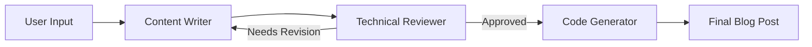
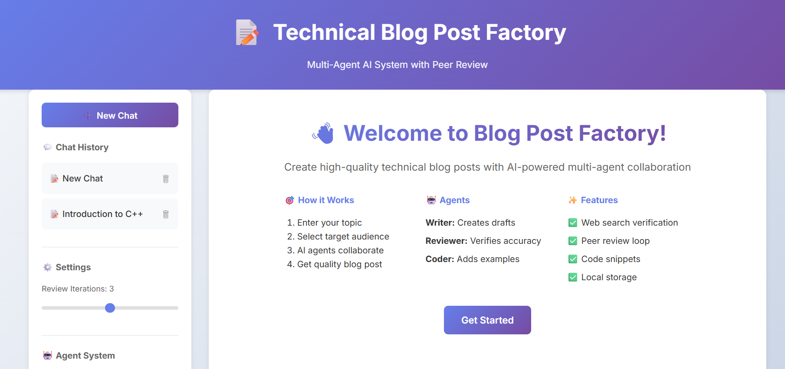

# 📝 Technical Blog Post Factory

<div align="center">

[](https://technical-blog-factory.onrender.com)

<br/>


**AI-Powered Multi-Agent System for Generating High-Quality Technical Blog Posts**

🌐 **Live Website:** [https://technical-blog-factory.onrender.com](https://technical-blog-factory.onrender.com)

[Features](#-features) • [Demo](#-demo) • [Installation](#-installation) • [Usage](#-usage) • [Architecture](#-architecture) • [API](#-api-documentation) • [Contributing](#-contributing)

</div>

---

## 🌟 Overview

Technical Blog Post Factory is an intelligent content generation system that leverages multiple AI agents working collaboratively to create professional, accurate, and engaging technical blog posts. Built with cutting-edge technologies including LangGraph, Google Gemini 2.5 Flash, and FastAPI.

### Why This Project?

- ⚡ **Save Time**: Generate comprehensive blog posts in minutes, not hours
- 🎯 **Ensure Quality**: Automated peer review loop catches errors and improves content
- 🔍 **Verify Accuracy**: Real-time web search validates technical information
- 💻 **Add Examples**: Automatic code snippet generation with best practices
- 🎨 **Professional Output**: Clean, well-structured markdown ready to publish

---

## ✨ Features

### 🤖 Multi-Agent Collaboration

Three specialized AI agents work together seamlessly:

| Agent | Role | Capabilities |
|-------|------|-------------|
| 📄 **Content Writer** | Draft Creation | Generates comprehensive blog posts tailored to your audience |
| 🔍 **Technical Reviewer** | Quality Assurance | Verifies accuracy using web search, provides detailed feedback |
| 💻 **Code Generator** | Example Creation | Adds relevant, well-commented code snippets |

### 🔄 Intelligent Workflow



- **Iterative Review**: 1 to 3 peer review cycles ensure precision and quality
- **Web Search Integration**: Real-time fact-checking via Tavily API
- **Smart Code Placement**: Automatically determines where code examples add value

### 🎨 Modern Web Interface

- **Responsive Design**: Adaptive layout across mobile, tablet, laptop, and 2K screens
- **Dark & Light Mode**: Seamless theme switching with persistent user preferences
- **Publication-Grade Export**: One-click Vector PDF download (via jsPDF), formatted Word/Google Docs clipboard copy, and Clean Text (.txt)
- **Input Guardrails**: Real-time validation preventing random numbers or gibberish from generating blogs
- **Chat History**: Save, restore, and delete articles with instant Undo protection
- **Local Storage**: All chats and preferences persisted locally in your browser

---

## 🎬 Demo

### Welcome Screen


### Generation Process


### Generated Blog Post


### Code Snippets Added


### Example Output

**Input:**
```
Topic: Introduction to Docker Containers
Audience: Beginners
```

**Output:**
A comprehensive blog post including:
- Clear introduction and conclusion
- Step-by-step explanations
- Practical code examples
- Best practices and tips
- Verified technical accuracy

---

## 🚀 Installation

### Prerequisites

- **Python 3.14+** ([Download](https://www.python.org/downloads/))
- **Google Gemini API Key** ([Get Free Key](https://aistudio.google.com/app/apikey))
- **Tavily API Key** ([Get Free Key](https://tavily.com))

### Quick Start

1. **Clone the repository**
   ```bash
   git clone https://github.com/yourusername/technical-blog-factory.git
   cd technical-blog-factory
   ```

2. **Install dependencies**
   ```bash
   pip install -r requirements.txt
   ```

3. **Configure environment**
   ```bash
   # Copy example env file
   cp .env.example .env
   
   # Edit .env and add your API keys
   GOOGLE_API_KEY=your_actual_gemini_key
   TAVILY_API_KEY=your_actual_tavily_key
   ```

4. **Run the application**
   
   **Windows:**
   ```bash
   start.bat
   ```
   
   **Mac/Linux:**
   ```bash
   python api/main_new.py
   ```

5. **Open your browser**
   ```
   http://localhost:8000
   ```

---

## 📖 Usage

### Web Interface

1. Click **"Get Started"** or **"New Chat"**
2. Enter your blog post topic
3. Select target audience (or enter custom)
4. Adjust review iterations (1-5)
5. Click **"Generate Blog Post"**
6. Watch the agents collaborate in real-time
7. Download or copy your finished blog post

### API Usage

```python
import requests

response = requests.post('http://localhost:8000/api/generate-blog', json={
    "topic": "Introduction to Kubernetes",
    "audience": "DevOps Engineers",
    "max_iterations": 3
})

result = response.json()
print(result['final_blog_post'])
```

### Python Integration

```python
from workflow.blog_workflow_new import BlogPostWorkflow

workflow = BlogPostWorkflow()
result = workflow.run(
    topic="Python Async Programming",
    audience="Intermediate Developers",
    max_iterations=3
)

print(result['final_blog_post'])
```

---

## 🏗️ Architecture

### Project Structure

```
technical-blog-factory/
├── agents/                       # AI Agent Implementations & Guardrails
│   ├── topic_validator.py       # Input validation (blocks numbers/gibberish)
│   ├── content_writer_new.py    # Draft generation agent
│   ├── technical_reviewer_new.py# Review and web-search verification agent
│   ├── code_snippet_new.py      # Code example generator
│   ├── llm_client.py            # Robust multi-model fallback client
│   └── state_new.py             # Shared state management
├── api/                          # FastAPI Backend
│   └── main_new.py              # REST API endpoints & static file serving
├── workflow/                     # LangGraph Workflow
│   └── blog_workflow_new.py     # Multi-agent state graph orchestration
├── web/                          # Modern Frontend
│   ├── index.html               # Main UI & Modals
│   ├── app.js                   # Application logic & vector PDF generator
│   ├── styles.css               # Design system & adaptive styling
│   └── vendor/
│       └── jspdf.umd.min.js     # Standalone Vector PDF engine
├── assets/                       # Documentation screenshots
├── .env.example                  # Environment configuration template
├── requirements.txt              # Python dependencies
├── start.bat                     # Windows one-click launcher
└── README.md                     # Comprehensive documentation
```

### Technology Stack

| Layer | Technology | Purpose |
|-------|-----------|---------|
| **AI Framework** | LangGraph 1.0+ | Multi-agent workflow orchestration |
| **LLM** | Google Gemini 2.5 Flash | Natural language generation |
| **Search** | Tavily API | Real-time web search for fact-checking |
| **Backend** | FastAPI 0.115+ | High-performance REST API |
| **Frontend** | Vanilla JS | Lightweight, responsive UI |
| **State** | Pydantic v2 | Type-safe data validation |

### Agent Details

#### Content Writer Agent
- **Model**: Gemini 2.5 Flash
- **Temperature**: 0.7 (creative)
- **Responsibilities**:
  - Generate initial drafts
  - Revise based on feedback
  - Maintain consistent tone
  - Structure content logically

#### Technical Reviewer Agent
- **Model**: Gemini 2.5 Flash
- **Temperature**: 0.3 (precise)
- **Responsibilities**:
  - Verify technical accuracy
  - Perform web searches
  - Provide constructive feedback
  - Approve final content

#### Code Snippet Agent
- **Model**: Gemini 2.5 Flash
- **Temperature**: 0.4 (balanced)
- **Responsibilities**:
  - Generate relevant code examples
  - Add helpful comments
  - Follow best practices
  - Ensure syntax correctness

---

## 📡 API Documentation

### Health Check
```http
GET /health
```

**Response:**
```json
{
  "status": "healthy",
  "gemini_api": "configured",
  "tavily_api": "configured",
  "python_version": "3.14.3"
}
```

### Generate Blog Post
```http
POST /api/generate-blog
Content-Type: application/json
```

**Request Body:**
```json
{
  "topic": "Introduction to Docker",
  "audience": "Beginners",
  "max_iterations": 3
}
```

**Response:**
```json
{
  "topic": "Introduction to Docker",
  "audience": "Beginners",
  "final_blog_post": "# Introduction to Docker\n\n...",
  "iterations": 2,
  "review_feedback": "Approved - excellent quality",
  "messages": [
    "Content Writer: Draft created (iteration 1)",
    "Technical Reviewer: Review requires revision (iteration 1)",
    "Content Writer: Draft revised (iteration 2)",
    "Technical Reviewer: Review approved (iteration 2)",
    "Code Snippet Agent: Generated 3 code snippet(s)"
  ],
  "code_snippets_count": 3,
  "status": "success"
}
```

---

## 🔧 Configuration

### Environment Variables

| Variable | Description | Required | Default |
|----------|-------------|----------|---------|
| `GOOGLE_API_KEY` | Google Gemini API key | ✅ Yes | - |
| `TAVILY_API_KEY` | Tavily search API key | ✅ Yes | - |
| `API_HOST` | Server host address | ❌ No | `0.0.0.0` |
| `API_PORT` | Server port number | ❌ No | `8000` |

### Model Configuration

Edit agent files to customize AI behavior:

```python
# agents/content_writer_new.py
self.llm = ChatGoogleGenerativeAI(
    model="gemini-2.5-flash",  # Change model
    temperature=0.7,            # Adjust creativity (0.0-1.0)
)
```

### Review Iterations

Adjust in the web interface or API request:
- **1-2 iterations**: Fast, good for simple topics
- **3 iterations**: Balanced (recommended)
- **4-5 iterations**: Thorough, best for complex topics

---

## 🐛 Troubleshooting

### Common Issues

#### API Key Errors
```
Error: API Key not found
```
**Solution**: 
- Verify `.env` file exists with correct keys
- Check keys are valid at [Google AI Studio](https://aistudio.google.com/)
- Ensure no extra spaces in `.env` file

#### Model Not Found
```
Error: models/gemini-2.5-flash is not found
```
**Solution**:
- Check your API tier supports Gemini 2.5 Flash
- Try fallback model: `gemini-pro`
- Verify quota at [Google AI Studio](https://aistudio.google.com/)

#### Port Already in Use
```
Error: Address already in use
```
**Solution**:
```bash
# Change port in .env
API_PORT=8001
```

#### Quota Exceeded
```
Error: 429 RESOURCE_EXHAUSTED
```
**Solution**:
- Wait for quota reset (usually 1 minute)
- Upgrade to paid tier for higher limits
- Use `gemini-pro` model (lower quota usage)

---

## 🤝 Contributing

Contributions are welcome! Here's how you can help:

### Ways to Contribute

- 🐛 Report bugs
- 💡 Suggest new features
- 📝 Improve documentation
- 🔧 Submit pull requests

### Development Setup

1. Fork the repository
2. Create a feature branch
   ```bash
   git checkout -b feature/amazing-feature
   ```
3. Make your changes
4. Test thoroughly
5. Commit with clear messages
   ```bash
   git commit -m "Add amazing feature"
   ```
6. Push to your fork
   ```bash
   git push origin feature/amazing-feature
   ```
7. Open a Pull Request

### Code Style

- Follow PEP 8 for Python code
- Use meaningful variable names
- Add docstrings to functions
- Keep functions focused and small

---

## 📄 License

This project is licensed under the MIT License - see below for details:

```
MIT License

Copyright (c) 2024 Technical Blog Post Factory

Permission is hereby granted, free of charge, to any person obtaining a copy
of this software and associated documentation files (the "Software"), to deal
in the Software without restriction, including without limitation the rights
to use, copy, modify, merge, publish, distribute, sublicense, and/or sell
copies of the Software, and to permit persons to whom the Software is
furnished to do so, subject to the following conditions:

The above copyright notice and this permission notice shall be included in all
copies or substantial portions of the Software.

THE SOFTWARE IS PROVIDED "AS IS", WITHOUT WARRANTY OF ANY KIND, EXPRESS OR
IMPLIED, INCLUDING BUT NOT LIMITED TO THE WARRANTIES OF MERCHANTABILITY,
FITNESS FOR A PARTICULAR PURPOSE AND NONINFRINGEMENT. IN NO EVENT SHALL THE
AUTHORS OR COPYRIGHT HOLDERS BE LIABLE FOR ANY CLAIM, DAMAGES OR OTHER
LIABILITY, WHETHER IN AN ACTION OF CONTRACT, TORT OR OTHERWISE, ARISING FROM,
OUT OF OR IN CONNECTION WITH THE SOFTWARE OR THE USE OR OTHER DEALINGS IN THE
SOFTWARE.
```

---

## 🙏 Acknowledgments

- **Google Gemini** - Powerful AI language model
- **LangGraph** - Excellent multi-agent framework
- **Tavily** - Reliable web search API
- **FastAPI** - Modern, fast web framework
- **LangChain** - Comprehensive AI toolkit

---

## 📧 Support & Contact

- **Issues**: [GitHub Issues](https://github.com/yourusername/technical-blog-factory/issues)
- **Discussions**: [GitHub Discussions](https://github.com/yourusername/technical-blog-factory/discussions)
- **Email**: your.email@example.com

---

## 🗺️ Roadmap

- [ ] Add support for multiple languages
- [ ] Implement image generation for blog posts
- [ ] Add SEO optimization suggestions
- [ ] Create browser extension
- [ ] Add export to Medium/Dev.to
- [ ] Implement user authentication
- [ ] Add collaborative editing
- [ ] Create mobile app

---

## ⭐ Star History

If you find this project useful, please consider giving it a star! ⭐

---

<div align="center">

**Made with ❤️ using AI and Modern Web Technologies**

[⬆ Back to Top](#-technical-blog-post-factory)

</div>
