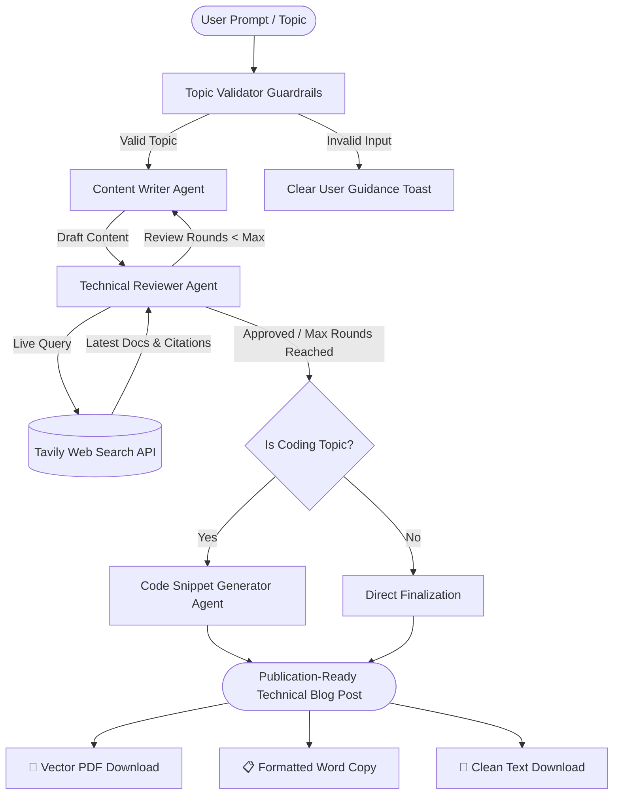

# 📝 Technical Blog Post Factory

<div align="center">

[](https://technical-blog-factory.onrender.com)

<br/>


<p align="center">
  <strong>An autonomous multi-agent AI studio that researches, writes, peer-reviews, and formats publication-grade technical blog posts with live web verification, syntax-checked code snippets, and vector PDF exports.</strong>
</p>

🌐 **Live Application:** [https://technical-blog-factory.onrender.com](https://technical-blog-factory.onrender.com)

[Live Demo](https://technical-blog-factory.onrender.com) • [Key Features](#-key-features) • [Multi-Agent Architecture](#-multi-agent-architecture) • [Quick Start](#-quick-start) • [API Reference](#-api-reference) • [Project Structure](#-project-structure)

</div>

---

## 🌟 Overview

**Technical Blog Post Factory** is an enterprise-ready AI writing pipeline built on **LangGraph 0.3+** and **FastAPI**. Unlike standard single-prompt LLM wrappers, it orchestrates a collaborative network of specialized agents that draft, research, critique, revise, and inject verified code snippets into publication-ready articles.

Every article undergoes iterative peer review cross-checked against live web documentation via the **Tavily API**, guaranteeing up-to-date technical accuracy before final export.

---

## ✨ Key Features

### 🤖 Autonomous Multi-Agent System
- **Content Writer Agent**: Generates structured, engaging drafts tailored to the chosen audience (*Beginners*, *Intermediate*, *Advanced*, *DevOps*, or *Architects*).
- **Technical Reviewer Agent**: Performs live web searches to fact-check claims against current official documentation, evaluating accuracy, clarity, and depth.
- **Strict Review Cycles**: Choose **1, 2, or 3 review iterations**. Every cycle triggers real critique and dedicated revision passes before final approval.
- **Code Snippet Agent**: Automatically detects programming topics (*e.g., Python, Docker, OOPs, SQL, React*) and generates syntax-verified, runnable code snippets. Intelligently skips code injection for conceptual or non-coding subjects (*e.g., History, Management*).

### 🛡️ Upfront Topic Guardrails
- Built-in validation engine prevents spam and hallucinations.
- Blocks pure numbers (`12345`, `837537`), keyboard walks (`asdfghjkl`, `sdhgiughsi`), and generic test placeholders (`abc`, `test`, `sample`).
- Accurately whitelists technical acronyms and short terms (`OOPs`, `SQL`, `Git`, `API`, `CSS`, `K8s`, `AI`).

### ⚡ Multi-Model Fallback Resilience
- Zero downtime or 429 quota failures: seamlessly cascades across **Gemini 2.5 Flash**, **Gemini 3.5 Flash-Lite**, and **Groq (`compound-mini`)** fallback providers.

### 📄 Publication-Grade Multi-Format Export
- 📕 **True Vector Text PDF**: Generated via standalone `jsPDF` with automatic page-break protection, running headers/footers, and syntax-highlighted code boxes (100% selectable and searchable; no raster screenshots or cut-off text).
- 📋 **Word / Google Docs Copy**: Formats clean text with bullet points, numbered lists, and code blocks—completely free of raw markdown asterisks (`**`) or hashes (`#`).
- 📄 **Clean Plain Text (.txt)**: Instant direct download of clean formatted text.

### 🎨 Modern Glassmorphic Web UI
- Responsive design tailored for screens from **360px mobile** up to **2K ultra-wide monitors**.
- Smooth **Dark / Light mode** toggle with persistent storage.
- In-app **Delete Modal** with instant **Undo** toast recovery.
- Live backend connection health monitor.

---

## 🏗️ Multi-Agent Architecture



---

## 🚀 Quick Start

### Prerequisites
- **Python 3.10+** (Tested on Python 3.11, 3.12, and 3.14)
- **Google Gemini API Key** ([Get Free Key from Google AI Studio](https://aistudio.google.com/app/apikey))
- **Tavily API Key** ([Get Free Key from Tavily](https://tavily.com))
- *(Optional)* **Groq API Key** ([Get Free Key from Groq](https://console.groq.com)) for secondary LLM fallback

### 1. Clone the Repository
```bash
git clone https://github.com/Ijlal-Hussaini/technical-blog-factory.git
cd technical-blog-factory
```

### 2. Install Dependencies
```bash
pip install -r requirements.txt
```

### 3. Configure Environment Variables
Copy the example environment file:
```bash
cp .env.example .env
```
Open `.env` and insert your API keys:
```env
GOOGLE_API_KEY=your_gemini_api_key_here
TAVILY_API_KEY=your_tavily_api_key_here
GROQ_API_KEY=your_optional_groq_key_here
API_HOST=0.0.0.0
API_PORT=8000
```

### 4. Launch the Application

**On Windows (One-Click Launcher):**
```cmd
start.bat
```

**On Linux / macOS:**
```bash
python api/main_new.py
```

Open your browser at:
```
http://localhost:8000
```

---

## ☁️ Live Cloud Deployment (Render)

This repository is pre-configured for automated deployment on **Render**:

1. Create a new **Web Service** on [Render](https://render.com) and connect this repository.
2. Set configuration:
   - **Environment**: `Python 3`
   - **Build Command**: `pip install -r requirements.txt`
   - **Start Command**: `uvicorn api.main_new:app --host 0.0.0.0 --port $PORT`
   - **Plan**: Free ($0/month)
3. Add your Environment Variables in the Render dashboard:
   - `GOOGLE_API_KEY`
   - `TAVILY_API_KEY`
   - `GROQ_API_KEY` (optional)
4. Click **Deploy**! Render will automatically build and serve your app with free HTTPS.

---

## 📁 Project Structure

```
technical-blog-factory/
├── agents/                       # Multi-Agent Implementations & Logic
│   ├── topic_validator.py       # Input guardrails against numbers, mash & spam
│   ├── content_writer_new.py    # Autonomous technical author agent
│   ├── technical_reviewer_new.py# Live web search fact-checker & reviewer
│   ├── code_snippet_new.py      # Syntax-tested code snippet generator
│   ├── llm_client.py            # Robust multi-model fallback engine
│   ├── state_new.py             # LangGraph Pydantic shared state
│   └── __init__.py
├── api/                          # FastAPI Backend Engine
│   ├── main_new.py              # REST endpoints, static file mounting & error handlers
│   └── __init__.py
├── workflow/                     # LangGraph State Graph
│   ├── blog_workflow_new.py     # Graph wiring, conditional edges & cycle control
│   └── __init__.py
├── web/                          # Modern Frontend Interface
│   ├── index.html               # Semantic HTML5 layout, modals & templates
│   ├── app.js                   # Application state, vector PDF engine & client validation
│   ├── styles.css               # Glassmorphic dark/light design system & responsive rules
│   ├── favicon.svg              # Custom vector SVG brand icon
│   └── vendor/
│       └── jspdf.umd.min.js     # Standalone Vector PDF library
├── assets/                       # Media & static repository assets
│   └── .gitkeep
├── .env.example                  # Environment variable configuration template
├── .gitignore                    # Git rules (ensures .env is never committed)
├── requirements.txt              # Production Python package dependencies
├── start.bat                     # Windows automated launcher script
├── LICENSE                       # MIT Open Source License
├── CONTRIBUTING.md               # Contribution guidelines
└── README.md                     # Project documentation
```

---

## 📡 API Reference

### Health Check
```http
GET /health
```
**Response (200 OK):**
```json
{
  "status": "healthy",
  "gemini_api": "configured",
  "tavily_api": "configured",
  "python_version": "3.14.3"
}
```

### Generate Blog Post
```http
POST /api/generate-blog
Content-Type: application/json
```

**Request Body:**
```json
{
  "topic": "OOPs Concepts in Java",
  "audience": "Beginners",
  "max_iterations": 2
}
```

**Response (200 OK):**
```json
{
  "topic": "OOPs Concepts in Java",
  "audience": "Beginners",
  "final_blog_post": "# Mastering OOPs Concepts in Java\n\nObject-Oriented Programming (OOP) is a foundational paradigm...",
  "iterations": 2,
  "review_feedback": "Approved - Technical accuracy verified against official documentation.",
  "messages": [
    "Content Writer: Draft created (iteration 1)",
    "Technical Reviewer: Round 1/2 critiqued (sent for revision)",
    "Content Writer: Draft revised (iteration 2)",
    "Technical Reviewer: Round 2/2 approved",
    "Code Snippet Agent: Generated 3 code snippet(s)"
  ],
  "code_snippets_count": 3,
  "status": "success"
}
```

---

## ⚙️ Environment Variables

| Variable | Description | Required | Default |
| :--- | :--- | :---: | :--- |
| `GOOGLE_API_KEY` | Primary LLM engine (Google AI Studio Gemini) | **Yes** | — |
| `TAVILY_API_KEY` | Real-time web search and fact-checking engine | **Yes** | — |
| `GROQ_API_KEY` | Secondary fallback LLM engine (Groq) | Optional | — |
| `API_HOST` | FastAPI server host binding | No | `0.0.0.0` |
| `API_PORT` | FastAPI server local port binding | No | `8000` |
| `PORT` | Cloud dynamic port (auto-set by Render) | No | `10000` |

---

## 🤝 Contributing

Contributions, feature suggestions, and bug reports are welcome!
1. Fork the Project.
2. Create your Feature Branch (`git checkout -b feature/AmazingFeature`).
3. Commit your Changes (`git commit -m "Add AmazingFeature"`).
4. Push to the Branch (`git push origin feature/AmazingFeature`).
5. Open a Pull Request.

---

## 📄 License

Distributed under the **MIT License**. See [LICENSE](LICENSE) for more information.

---

<div align="center">

**Built with ❤️ by [Ijlal Hussain](https://github.com/Ijlal-Hussaini)**

</div>
